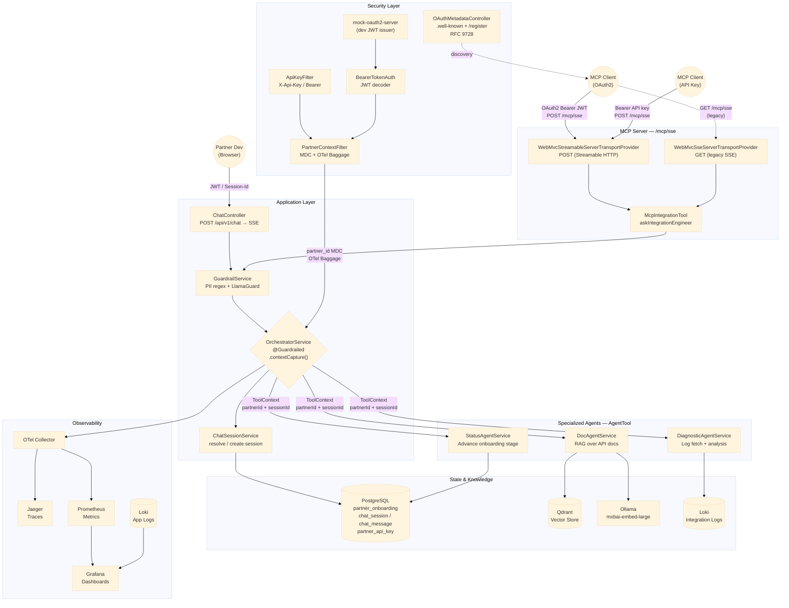

# Partner Onboarding Chatbot — Architecture

## Overview

A conversational multi-agent system that guides partner engineers through a technical integration roadmap. The chatbot is the interface; behind it, multiple specialized agents coordinate to reason over API documentation, diagnose errors from logs, and advance the partner through each onboarding stage.

Partners can interact through two surfaces: a **web UI** (browser SSE) and an **MCP server** (Claude Code or any MCP-compatible client), both protected by the same authentication and authorization pipeline.

---

## System Design



---

## Authentication & Access

Two authentication methods are supported, processed by the same filter chain:

### OAuth2 / JWT
- Partners authenticate via `mock-oauth2-server` (dev) or a real IdP (prod).
- `BearerTokenAuthenticationFilter` decodes the JWT using `NimbusJwtDecoder.withJwkSetUri`, validated against the issuer's JWKS endpoint.
- The JWT `sub` claim becomes the `partnerId`.
- MCP clients discover the OAuth server via `/.well-known/oauth-authorization-server` and `/.well-known/oauth-protected-resource` (RFC 9728). Dynamic client registration is supported at `POST /register`.

### API Key
- Partners obtain an API key via `POST /dev/api-key` (hashed with SHA-256, stored in `partner_api_key`).
- `ApiKeyFilter` checks both `X-Api-Key` header and `Authorization: Bearer` header, enabling the same key to work for REST and MCP clients.
- On match, it sets a `UsernamePasswordAuthenticationToken` with the `partnerId` as the principal before `BearerTokenAuthenticationFilter` runs.

### `PartnerContextFilter`
Runs after authentication. Extracts `partnerId` from either a `Jwt` principal (OAuth2) or a `String` principal (API key), then:
- Puts `partner_id` in MDC for all log lines on that request.
- Sets `partner.id` as OTel Baggage so it propagates to child spans automatically.

### Security configuration highlights
- `RequestAttributeSecurityContextRepository` — saves the `SecurityContext` as a servlet request attribute. Survives Tomcat async dispatches (SSE keepalive, MCP streaming) without re-authenticating.
- `WebSecurityCustomizer.ignoring("/error")` — bypasses the filter chain for Tomcat error-page dispatches so async SSE errors don't cascade into spurious `Access Denied` log noise.
- `@PartnerId` method parameter annotation — `PartnerIdArgumentResolver` extracts `partnerId` from the `SecurityContext` in controller methods, keeping it out of request parameters entirely.

---

## MCP Server

The MCP server exposes the orchestrator as a single tool (`askIntegrationEngineer`) consumable by any MCP-compatible client (Claude Code, Cursor, etc.).

### Dual transport at `/mcp/sse`

| Transport | Method | Protocol | Used by |
|---|---|---|---|
| `WebMvcSseServerTransportProvider` | `GET` | Legacy SSE | SSE-type MCP clients |
| `WebMvcStreamableServerTransportProvider` | `POST` | Streamable HTTP | HTTP-type MCP clients (OAuth2 + API key) |

Both transports are registered on the same path and coexist via Spring MVC's `RouterFunction` composition. Both use a `contextExtractor` that reads `partner_id` from the JWT subject or String principal and injects it into the `McpTransportContext`.

### Session type discrimination
`McpIntegrationTool` detects how the partner authenticated by inspecting the transport context:

- `partner_id` present in transport context → JWT/OAuth2 → `SessionType.MCP_OAUTH`
- Absent (falls back to MDC) → API key → `SessionType.MCP_API_KEY`

This keeps MCP OAuth and API key conversation histories cleanly separated even if the MCP session ID collides.

---

## Orchestrator Design

### Streaming response (Reactor Flux)

`OrchestratorService.processInput()` was refactored from a blocking, collect-then-return model to a fully streaming pipeline using Spring AI's `.stream().chatResponse()`:

```
Before: LLM generates full response → collect → return String  (time-to-first-token = full latency)
After:  LLM generates tokens → Flux<String> emitted per chunk   (time-to-first-token ≈ milliseconds)
```

Both consumers handle the `Flux<String>` natively:
- **Web controller** — subscribes and forwards each chunk to a `SseEmitter`, so the browser starts rendering the moment the first token arrives.
- **MCP tool** — collects via `.collectList().map(String::join).block()`. From the MCP caller's perspective this is a single synchronous response — there is no streaming benefit for the end user. Token metering (`doOnNext`) and the latency timer (`doOnComplete`) still fire progressively as tokens arrive from the LLM because those operators sit upstream of `.collectList()` in the Flux chain.

### Prompt engineering & token reduction

System prompt and per-stage instructions were rewritten to be directive rather than explanatory. Claude Haiku does not require verbose context to follow structured instructions — concision improves compliance and reduces cost.

| Component | Before (est.) | After (measured) | Δ |
|---|---|---|---|
| System prompt | ~1,800 tokens | ~150 tokens | −1,650 |
| Stage instructions | ~400 tokens avg | ~45 tokens avg | −355 |
| **Total per call** | **~2,200 tokens** | **~195 tokens** | **−2,005 tokens** |

At Haiku input pricing ($0.25 / MTok):

- **Per call:** ~$0.0005 saved
- **At 10k calls/day:** ~$150/month

The reduction also improved **Qdrant retrieval quality**. The original verbose system prompt caused `docAgentTool` to generate broad, context-heavy queries that diluted the embedding similarity score. The tighter prompt produces focused, keyword-dense queries that align better with the chunk embeddings, lifting effective retrieval precision without changing `topK` or `similarityThreshold`.

---

## Agent-to-Agent Architecture

The orchestration model is a **centralized supervisor** — one `OrchestratorService` holds the `ChatClient` and decides which agents to invoke based on the conversation. Agents do not call each other directly.

**Routing** is LLM-as-router: the model receives all registered tools and decides when to invoke each one based on intent. A partner saying "this isn't working" may trigger both `getLatestLogs` and `docAgentTool` in the same turn.

**Agent auto-discovery** uses a marker interface:

```java
public interface AgentTool {}
```

Any `@Service` implementing `AgentTool` is automatically injected into the orchestrator via `List<AgentTool>`. Adding a new agent requires zero changes to the orchestrator.

**Current agents:**

| Agent | Responsibility |
|---|---|
| `DocAgentService` | RAG retrieval over API documentation |
| `DiagnosticAgentService` | Fetch and analyze integration logs via `LogProvider` |
| `StatusAgentService` | Advance partner through onboarding stages |

**MDC restoration in agent tools** — `RestoreMdcAspect` intercepts all `AgentTool` implementations before each tool invocation: it restores `partner_id` and `session_id` from `ToolContext`, then reads `Span.current()` (the tool child span, made current by `TracingToolCallingManager` before execution) and writes `trace_id`/`span_id` into MDC. Agent tool logs always carry the full trace and partner context with the same `trace_id` as the orchestrator.

---

## Reactor Context Propagation

`OrchestratorService.processInput()` returns a `Flux<String>`. Reactor operators (`doOnNext`, `doOnComplete`, agent tool calls) run on scheduler threads that do not inherit the HTTP request's `ThreadLocal` state. Four complementary mechanisms address this:

**1. MDC propagation (partner_id, session_id)**

`.contextCapture()` is appended to the Flux chain. At subscription time it snapshots all registered `ThreadLocalAccessor` values — including MDC keys via `Slf4jThreadLocalAccessor` — into Reactor's `ContextView`. `Hooks.enableAutomaticContextPropagation()` (enabled by Spring Boot at startup) causes every downstream operator to restore those MDC thread-locals before executing its callback. `partner_id` (set by `PartnerContextFilter`) and `trace_id`/`span_id` (injected by `processInput()` before the Flux is assembled) are thus available on all scheduler threads without any additional wiring.

**2. OTel span propagation into agent tool calls (TracingToolCallingManager)**

Spring AI's `DefaultToolCallingManager` executes tool calls synchronously inside a Reactor `flatMap` on a scheduler thread. By the time execution reaches the tool, Micrometer's observation infrastructure has already opened and closed its own OTel scope, clearing `Span.current()`. Without intervention, each tool call produces a disconnected root span with a different trace ID.

`TracingToolCallingManager` wraps `DefaultToolCallingManager` and fixes this: `OrchestratorService` captures `callerSpan = Span.current()` on the request thread before assembling the Flux, places it in `ToolContext` alongside `partnerId` and `sessionId`, and `TracingToolCallingManager.executeToolCalls()` reads it back and calls `callerSpan.makeCurrent()` before delegating. `DefaultToolCallingManager`'s Micrometer observation then creates tool child spans under the now-current parent span. `RestoreMdcAspect` reads the restored `Span.current()` (the child span) and writes `trace_id`/`span_id` into MDC — same trace ID as the orchestrator, different span ID.

The `callerSpan` in `ToolContext` is invisible to `AgentTool` implementations; only the infrastructure layer reads it.

**3. Terminal callback (doOnComplete)**

`doOnComplete` runs on a terminal signal thread after the Flux completes; the Reactor context restore has already been torn down at that point. `OrchestratorService` reuses the `callerSpan` reference captured in step 2 and calls `callerSpan.makeCurrent()` explicitly inside `doOnComplete` around the token log line so it carries the correct trace.

**4. ResponseLoggingFilter**

For SSE responses, Spring promotes the connection to async context before the Flux has finished emitting, closing the OTel span scope in the process. `ResponseLoggingFilter` captures the span *before* `chain.doFilter()` while the scope is still open, then injects `trace_id`/`span_id` into MDC around the post-response log line.

**Result:** every log line — whether from the orchestrator, an agent tool, or the response filter — carries the same `trace_id`, `span_id`, and `partner_id` as the originating HTTP request, regardless of thread switches. In Jaeger, tool call spans appear as children of the orchestrator span within a single unified trace.

---

## State Management

**`PartnerOnboarding`** — persistent progress record, one per partner, survives across all sessions. Holds current onboarding stage, stage-specific context, and timestamps.

**`ChatSession`** — one per conversation window. Unique on `(partner_id, session_id, session_type)`. Session type encodes the surface:

| `session_type` | Surface |
|---|---|
| `WEB` | Browser UI |
| `MCP_OAUTH` | MCP client authenticated via OAuth2 JWT |
| `MCP_API_KEY` | MCP client authenticated via API key |

The 3-column unique constraint prevents cross-surface session collisions and makes it impossible for a partner to accidentally read another partner's session history. `ChatSessionService.resolveSession` does a direct DB lookup on all three columns — no post-filter needed.

**Memory** uses a custom `PartnerChatMemoryRepository` backed by PostgreSQL, scoped to `sessionId`. Window is 4 messages (`MessageWindowChatMemory`).

---

## Guardrails & Data Privacy

**Tenant isolation** is enforced at the tool level via Spring AI's `ToolContext`. The `partnerId` is extracted from the JWT/API key in `PartnerContextFilter` and injected into every tool call. The LLM never supplies or influences the `partnerId`:

```java
String partnerId = (String) toolContext.getContext().get("partnerId");
```

**PII scrubbing** in `GuardrailService.sanitize()` removes sensitive data before it enters or leaves the LLM context window. Patterns covered: credit/debit cards, emails, IPv4, IPv6, Bearer tokens, JWT, API keys (`sk-`, `pk-`, `gsk_`), AWS access keys, phone numbers, CPF, CNPJ.

**Content moderation** via `GuardrailService` wraps both input and output through a `@Guardrailed` AOP aspect on `processInput`. Production path connects to LlamaGuard via Ollama (`llama-guard3`).

---

## Observability

**Distributed tracing** — OpenTelemetry with Jaeger. `ObservationConfig` wires a custom pipeline: `ObservationRegistry` → `DefaultTracingObservationHandler` → `OtelTracer` → `OtlpGrpcSpanExporter` → `otel-collector:4317` → Jaeger. Spring Boot's auto-configured OTLP exporter uses HTTP/4318 and does not wire the custom `OtelTracer`; the manual gRPC configuration is required. `partner.id` and `session.id` are set as OTel Baggage in `PartnerContextFilter`. `TracingToolCallingManager` ensures tool call spans appear as children of the orchestrator span (same trace ID, distinct span IDs) rather than disconnected root spans. Jaeger uses Badger file-based storage (`SPAN_STORAGE_TYPE=badger`) so traces survive container restarts.

**Structured logging** — Loki via Promtail. Every log line includes `trace_id`, `span_id`, and `partner_id` via MDC. `ResponseLoggingFilter` logs `partner method path → status` for every authenticated MCP and REST request by reading MDC directly (not request attributes). `OpenTelemetryAppender` is intentionally absent from `logback-spring.xml` — it reads `Span.current()` at log time and would overwrite the MDC-propagated `trace_id` with Spring AI's scheduler-thread spans, breaking correlation.

**Response headers** — `X-Trace-Id` returned on every web API response for support correlation.

**Prometheus metrics:**

| Metric | Tags | Purpose |
|---|---|---|
| `orchestrator.llm.latency` | `status` | LLM response time per onboarding stage (histogram) |
| `doc.agent.calls` | — | Total doc retrieval attempts |
| `doc.agent.empty.results` | — | Miss rate — gaps in documentation coverage |
| `diagnostic.agent.calls` | — | Total log fetch attempts |
| `stage.advancement` | `from`, `to` | Partner progression through stages |
| `guardrail.blocked` | `direction` | Input/output blocks |
| `llm.tokens.input` | `partner`, `status` | Input token consumption per partner per stage |
| `llm.tokens.output` | `partner`, `status` | Output token consumption per partner per stage |

`percentiles-histogram: true` on `orchestrator.llm.latency` enables accurate p95 across replicas via `histogram_quantile`.

**Grafana dashboards** provisioned via `grafana/provisioning/` — survive container restarts, version-controlled alongside code.

---

## Knowledge & Data Access

**RAG pipeline:**
1. Markdown docs loaded from `docs_folder/` on startup via `ApplicationReadyEvent`
2. Chunked with `TokenTextSplitter` (250 tokens, 100 char minimum)
3. Source filename attached as metadata to every chunk
4. Embedded via `mxbai-embed-large` through Ollama
5. Stored in Qdrant (`initialize-schema: true`)

Retrieval: similarity search with `topK(4)`, `similarityThreshold(0.5)`. Empty results return an explicit message rather than an empty string. Source attribution is included so the LLM can tell partners which document answered their question.

**Log retrieval** uses a `LogProvider` interface:
- `LokiLogProvider` (`@Profile("!test")`) — queries Loki via LogQL, filters for `/v1/auth`, `/v1/webhooks`, `/v1/orders`, last hour, limit 20
- `MockLogProvider` (`@Profile("test")`) — deterministic per-partner log data for evaluation

---

## Infrastructure

| Service | Purpose |
|---|---|
| PostgreSQL 16 | Partner onboarding state, chat sessions, message history, API keys |
| Qdrant | Vector store for RAG |
| Ollama | Embeddings (`mxbai-embed-large`) + guardrails (`llama-guard3`) |
| Anthropic Claude | Primary LLM (`claude-haiku-4-5-20251001`) |
| OTel Collector | Trace and metric collection |
| Jaeger | Distributed trace visualization |
| Prometheus | Metrics scraping |
| Grafana | Dashboards and log correlation |
| Loki + Promtail | Log aggregation |
| Mock OAuth2 Server | JWT issuer for local development |

---

## Database Schema

```sql
partner_onboarding           -- one per partner, holds progress
  id UUID PK
  partner_id VARCHAR UNIQUE
  current_status VARCHAR      -- START | AUTH_CONFIGURED | WEBHOOK_SET | LIVE
  context_json JSONB
  created_at, updated_at TIMESTAMP

partner_api_key              -- hashed API keys for direct access
  id UUID PK
  partner_id VARCHAR
  hashed_key VARCHAR UNIQUE   -- SHA-256
  created_at TIMESTAMP
  active BOOLEAN

chat_session                 -- one per conversation window
  id UUID PK
  session_id VARCHAR
  session_type VARCHAR        -- WEB | MCP_OAUTH | MCP_API_KEY
  partner_id VARCHAR FK → partner_onboarding.partner_id
  started_at TIMESTAMP
  UNIQUE (partner_id, session_id, session_type)

chat_message                 -- one per turn
  id UUID PK
  session_id UUID FK → chat_session.id
  role VARCHAR                -- user | assistant | system
  content TEXT
  created_at TIMESTAMP
```

---

## Onboarding Stages

| Stage | Mission | Advance condition |
|---|---|---|
| `START` | Configure auth, call `/v1/auth` | Auth endpoint returning 200 in logs |
| `AUTH_CONFIGURED` | Configure webhook endpoint, call `/v1/webhooks` | Webhook endpoint returning 200 in logs |
| `WEBHOOK_SET` | Validate full flow end to end | Partner confirms events received, logs confirm |
| `LIVE` | Production — monitor and escalate | Final stage — directs to `#r2-support` |

Each stage exposes `getInstructions()` (injected into system prompt) and `getNext()` (used by `StatusAgentService`).

---

## Trade-offs & Future Improvements

| Item | Notes |
|---|---|
| LlamaGuard wiring | `llama-guard3` via Ollama — architecture ready, stubbed due to GPU constraints during development |
| Rate limiting | `Bucket4j` per `partnerId` — prevent flooding, control LLM cost per partner |
| MCP client pattern | `LogProvider` interface is the natural MCP client integration point — swap `LokiLogProvider` for a Datadog MCP client when available, zero orchestrator changes |
| Blue/green doc ingestion | Two Qdrant collections — ingest into shadow, swap on completion — zero-downtime doc updates |
| Real partner JWT | Replace `mock-oauth2-server` with real identity provider — `SecurityConfig` already uses `NimbusJwtDecoder.withJwkSetUri` for lazy JWKS loading |
| MCP SSE legacy | `WebMvcSseServerTransportProvider` kept for backward compat — new integrations should use `type: "http"` (Streamable HTTP) in their MCP client config |
| Kubernetes | Docker Compose for local dev — EKS-compatible with registry and storage class changes only |
| Async message persistence with encryption | See below |

### Async chat message persistence with encryption

**Current state:** `PartnerChatMemoryRepository` writes each `ChatMessage` synchronously to PostgreSQL inside the request thread. This adds DB latency to the streaming critical path and stores message content as plaintext.

**Proposed design:**

```
OrchestratorService (request thread)
    │  publishes ChatMessageEvent (serialized, encrypted)
    ▼
Redis Stream  ─or─  RabbitMQ Exchange
    │  consumer group (separate thread pool)
    ▼
MessagePersistenceConsumer
    │  decrypts → validates → upserts
    ▼
PostgreSQL  chat_message (content_ciphertext, key_id columns)
```

The `PartnerChatMemoryRepository` read path remains synchronous — it decrypts on fetch so the orchestrator's context window assembly is unaffected. Only the write path becomes async.

**Encryption:** AES-256-GCM per-partner key, rotatable without re-reading old messages (key ID stored alongside ciphertext). Envelope encryption: data key encrypted with a master key held in HashiCorp Vault or AWS KMS, never in the application config.

**Schema additions (Flyway migration):**

```sql
ALTER TABLE chat_message
    ADD COLUMN content_ciphertext BYTEA,
    ADD COLUMN key_id             VARCHAR(64),
    ADD COLUMN iv                 BYTEA;          -- GCM nonce
-- content TEXT stays for migration window, then dropped
```

**Required dependencies (`build.gradle`):**

```groovy
// Async transport — choose one:
implementation 'org.springframework.boot:spring-boot-starter-amqp'         // RabbitMQ
implementation 'org.springframework.boot:spring-boot-starter-data-redis'   // Redis Streams

// Encryption
implementation 'org.springframework.security:spring-security-crypto'       // AES-256-GCM via Encryptors.stronger()

// Key management (production)
implementation 'org.springframework.vault:spring-vault-core:3.1.2'         // HashiCorp Vault transit engine
// or AWS KMS via AWS SDK v2 — no Spring wrapper needed
```

`spring-security-crypto` (`Encryptors.stronger(password, salt)`) provides AES-256-CBC out of the box; for GCM (authenticated encryption, no padding oracle) use `javax.crypto` directly with `AES/GCM/NoPadding` — it is part of the JDK and requires no additional dependency.

**Why RabbitMQ over Redis Streams for this use case:** RabbitMQ's dead-letter exchange gives automatic retry + poison-message handling without custom consumer logic. Redis Streams require manual `XACK` management and dead-letter wiring. Either works; RabbitMQ is lower operational risk when the payload (plaintext conversation turn) must not be silently dropped.
