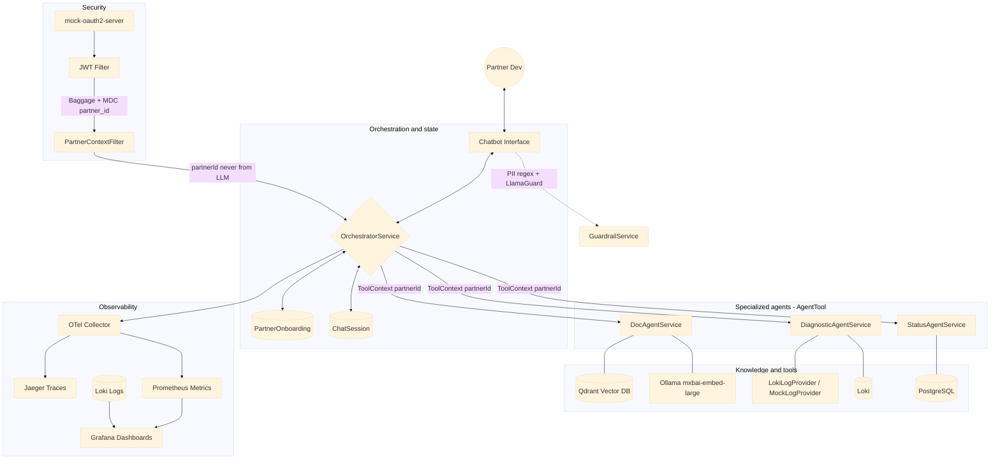

# Partner Onboarding Chatbot — Architecture

## Overview

A conversational multi-agent system that guides partner engineers through a technical integration roadmap. The chatbot is the interface; behind it, multiple specialized agents coordinate to reason over API documentation, diagnose errors from logs, and advance the partner through each onboarding stage.

---

## System Design
<style>
  .mermaid svg {
    width: 102% !important;
    height: auto !important;
  }
</style>



### Agent-to-agent architecture

The orchestration model is a **centralized supervisor** — one `OrchestratorService` holds the `ChatClient` and decides which agents to invoke based on the conversation. Agents do not call each other directly.

**Routing** is LLM-as-router: the model receives all registered tools and decides when to invoke each one based on intent. This handles ambiguous and compound requests naturally — a partner saying "this isn't working" may trigger both `getLatestLogs` and `docAgentTool` in the same turn.

**Agent auto-discovery** uses a marker interface:

```java
public interface AgentTool {}
```

Any `@Service` implementing `AgentTool` is automatically injected into the orchestrator via `List<AgentTool>`. Adding a new agent requires zero changes to the orchestrator.

**Current agents:**

| Agent | Responsibility |
|---|---|
| `DocAgentService` | RAG retrieval over API documentation |
| `DiagnosticAgentService` | Fetch and analyze integration logs via `LogProvider` |
| `StatusAgentService` | Advance partner through onboarding stages |

**State management** is split across two concerns:

- `PartnerOnboarding` — persistent progress record, one per partner, survives across all sessions
- `ChatSession` — ephemeral conversation window, scoped memory, resets when partner opens a new chat

---

### Guardrails & data privacy

**Tenant isolation** is enforced at the tool level via Spring AI's `ToolContext`. The `partnerId` is extracted from the JWT in `PartnerContextFilter` and injected into every tool call. The LLM never supplies or influences the `partnerId` — it is always sourced from the authenticated request:

```java
String partnerId = (String) toolContext.getContext().get("partnerId");
```

**Per-tool permission constraints** are declared in tool descriptions using explicit `NEVER` clauses, providing a soft guardrail that guides LLM decisions. Hard enforcement happens in code regardless of what the model decides.

**PII scrubbing** in `GuardrailService.sanitize()` removes sensitive data before it enters or leaves the LLM context window. Patterns covered: credit/debit cards, emails, IPv4, IPv6, Bearer tokens, JWT, API keys (sk-, pk-, gsk_), AWS access keys, phone numbers, CPF, CNPJ.

**Content moderation** via `GuardrailService` wraps both input and output through a `@Guardrailed` AOP aspect on `processInput`. Current implementation uses regex sanitization. Production path connects to LlamaGuard via Ollama (`llama-guard3`) for semantic threat detection including prompt injection.

**Session security** — `ChatSession` lookup validates that the `partnerId` on the session matches the authenticated request, preventing session hijacking across tenants.

---

### Observability & evaluation

**Distributed tracing** uses OpenTelemetry with Jaeger. `partner.id` and `session.id` are set as OTel Baggage in `PartnerContextFilter` and `ContextPropagationAspect`, propagating automatically to all child spans without manual instrumentation in each tool.

**Structured logging** ships to Loki via Promtail. Every log line includes `trace_id`, `span_id`, and `partner_id` via MDC, enabling Grafana to correlate logs to traces automatically. Integration endpoint responses are logged via `ResponseLoggingAspect` on `MockedOnboardingAPIController`.

**Response headers** — `X-Trace-Id` is returned on every API response so partners can quote it in support requests.

**Prometheus metrics:**

| Metric | Tags | Purpose |
|---|---|---|
| `orchestrator.llm.latency` | `status` | LLM response time per onboarding stage (histogram) |
| `doc.agent.calls` | — | Total doc retrieval attempts |
| `doc.agent.empty.results` | — | Miss rate — gaps in documentation coverage |
| `diagnostic.agent.calls` | — | Total log fetch attempts |
| `stage.advancement` | `from`, `to` | Partner progression through stages |
| `guardrail.blocked` | `direction` | Input/output blocks |

`percentiles-histogram: true` is configured for `orchestrator.llm.latency` so Prometheus can compute accurate p95 across multiple replicas using `histogram_quantile`.

**Grafana dashboards** are provisioned via config files in `grafana/provisioning/` — survive container restarts, version controlled alongside code.

**Offline evaluation** uses a golden set (`src/test/resources/Test-set.json`) with keyword-based scoring run via `SetEvaluationTest`. The test calls the full HTTP stack via `WebTestClient` with real JWTs from mock-auth, exercising the complete filter chain, session creation, and agent routing.

---

### Knowledge & data access

**RAG pipeline:**

1. Markdown docs loaded from `docs_folder/` on startup via `ApplicationReadyEvent`
2. Chunked with `TokenTextSplitter` (250 tokens, 100 char minimum)
3. Source filename attached as metadata to every chunk before splitting
4. Embedded via `mxbai-embed-large` through Ollama
5. Stored in Qdrant vector store (`initialize-schema: true`)

**Retrieval** uses similarity search with `topK(4)` and `similarityThreshold(0.5)`. Empty results return an explicit message rather than an empty string, preventing LLM hallucination on missing content. Source attribution is included in every result so the LLM can tell partners which document an answer came from.

**Log retrieval** uses a `LogProvider` interface with two implementations:

- `LokiLogProvider` (`@Profile("!test")`) — queries Loki via LogQL using `UriComponentsBuilder` for safe encoding, filters for `/v1/auth`, `/v1/webhooks`, `/v1/orders` lines, last hour, limit 20
- `MockLogProvider` (`@Profile("test")`) — returns deterministic per-partner log data for golden set evaluation

**Memory** uses a custom `PartnerChatMemoryRepository` backed by PostgreSQL, scoped to `sessionId`. Memory window is 4 messages (`MessageWindowChatMemory`).

---

## Infrastructure

| Service | Purpose |
|---|---|
| PostgreSQL 16 | Partner onboarding state, chat sessions, message history |
| Qdrant | Vector store for RAG |
| Ollama | Embeddings (`mxbai-embed-large`) |
| Anthropic Claude Haiku | Primary LLM for chat (`claude-haiku-4-5-20251001`) |
| OTel Collector | Trace and metric collection |
| Jaeger | Distributed trace visualization |
| Prometheus | Metrics scraping (pod annotation discovery in Kubernetes) |
| Grafana | Dashboards and log correlation |
| Loki + Promtail | Log aggregation |
| Mock OAuth2 Server | JWT issuer for local development |

---

## Database Schema

```sql
partner_onboarding   -- one per partner, holds progress
  id UUID PK
  partner_id VARCHAR UNIQUE
  current_status VARCHAR   -- START | AUTH_CONFIGURED | WEBHOOK_SET | LIVE
  created_at, updated_at TIMESTAMP

chat_session         -- one per conversation window
  id UUID PK
  session_id VARCHAR UNIQUE
  partner_id VARCHAR FK → partner_onboarding.partner_id
  started_at TIMESTAMP

chat_message         -- one per turn
  id UUID PK
  session_id UUID FK → chat_session.id
  role VARCHAR        -- user | assistant | system
  content TEXT
  created_at TIMESTAMP
```

---

## Onboarding Stages

| Stage | Mission | Advance condition                                                     |
|---|---|-----------------------------------------------------------------------|
| `START` | Configure HMAC-SHA256 auth, call `/v1/auth` | Auth endpoint returning 200 in logs                                   |
| `AUTH_CONFIGURED` | Configure webhook endpoint, call `/v1/webhooks` | Webhook endpoint returning 200 in logs                                |
| `WEBHOOK_SET` | Validate full flow end to end | Partner confirms events received successfully, review logs to confirm |
| `LIVE` | Production — monitor and escalate | Final stage — directs to `#r2-support` for issues                     |

Each stage exposes `getInstructions()` (injected into system prompt) and `getNext()` (used by `StatusAgentService`).

## Trade-offs & Future Improvements

| Item | Notes |
|---|---|
| LlamaGuard wiring | `llama-guard3` via Ollama — architecture ready, stubbed due to GPU constraints during development |
| Rate limiting | `Bucket4j` per `partnerId` — prevent flooding, control LLM cost per partner |
| MCP client pattern | `LogProvider` interface is the natural MCP client integration point — swap `LokiLogProvider` for a Datadog MCP client when official server ships, zero orchestrator changes |
| Blue/green doc ingestion | Two Qdrant collections — ingest into shadow, swap on completion — zero-downtime doc updates |
| Real partner JWT | Replace `mock-oauth2-server` with real identity provider — `SecurityConfig` already uses `NimbusJwtDecoder.withJwkSetUri` for lazy JWKS loading |
| Kubernetes | Manifests in `k8s/` — Docker Desktop for local, identical manifests for EKS with registry and storage class changes only |